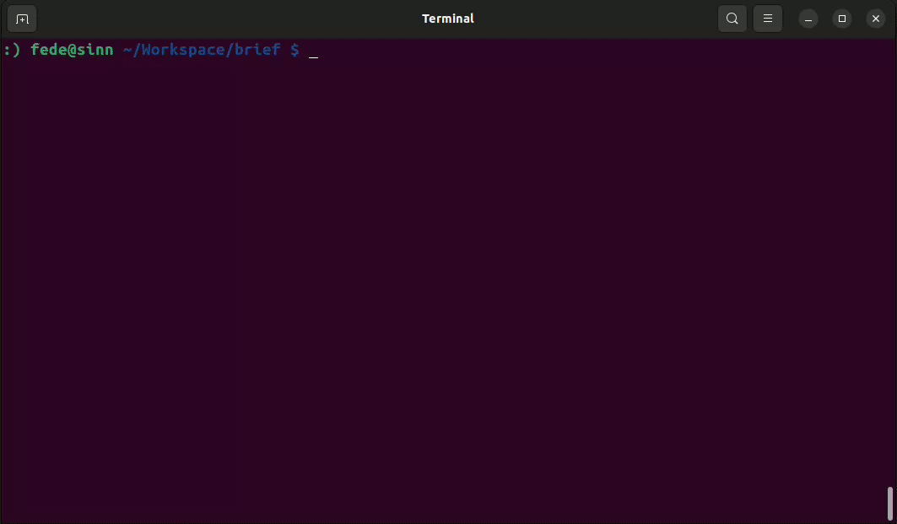

# brief ⌨️
Build terminal commands via an interactive and documentable interface, in the style of [Magit's](https://magit.vc/) [transient](https://github.com/magit/transient). This is done by using cmd.yaml files - which are like OpenAPI but for describing command options.

<p align="center">
  
  <br/>
</p>

_The video shows `brief` being used to select options for `curl`, like `-v` and `-H`._

> [!IMPORTANT]
> I am not actively maintaining this project, as I couldn't find a use case that was particularly useful for me. However, someone else might find the idea interesting and decide to fork it or create a similar project (it's definitely better than leaving it as a private repo). For me, it was more of a short experiment.

## Building
With Go 1.20 or newer installed, clone the repository and inside of it run:
```
make build
```

Then, you'll be able to execute `./brief` locally.

## Usage
Currently, `brief` only takes one option: the path to a cmd.yaml (explained in the next section) file containing the command options specifications for a command, e.g. `curl`. There are some example specifications provided in the [`examples/`](examples/) directory. Try using the one for `curl`:
```
./brief examples/curl.cmd.yaml
```

Then, press `?` to get a quick set of instructions on how the main interface works. If you're familiar with Magit, it works quite similarly to how the `commit` or `log` set of transient suffix commands work. You can use left and right arrow keys to move the virtual cursor through the command components, and use delete or backspace to delete them.

## cmd.yaml

tl;dr: cmd.yaml is like OpenAPI for command options.

`brief` takes the command's description from files using a structure called cmd.yaml. These files are simply a YAML file that describes a command, its subcommands, and the options for them.

A sidenote: different frameworks and programming languages use different terminologies to refer to command options, like: argument, option, positional argument, flag, variable, etc. For `brief`, I settled on the following terms:
- A **command** (like `git`) is the basic element `brief` operates on.
- Commands can have **subcommands** (like `git remote`). Subcommands are themselves also commands. Therefore, subcommands can also have subcommands (like `git remote add`).
- Commands have multiple **options**. Each option can be either a:
  - **flag**: Flags consist of a pre-defined string (like `-X`) followed by an optional value (like `POST`). Flags have many attributes that can be configured, for example whether the value is required or not.
  - **argument**: Arguments are a value without any constant string before them, like the URL used with `curl`.

The [examples/foo.cmd.yaml](examples/foo.cmd.yaml) file documents a fictional `foo` commands that uses all possible configuration options for a command. For the moment it is the best source for understanding cmd.yaml files. Here's a short section of it, as an example:
```yaml
specVersion: 1.0.0
command:
  name: foo
  version: 1.0.0
  help: The foo command allows quick testing of the brief interface
  options:
  - flag: ["--help"]
    help: Show foo help
    type: toggle
  subcommands:
  - name: bar
    help: The bar subcommand
    options:
    - flag: ["--optional"]
      help: Test how optional value flags work
      type: valueOptional
    - argument: first
      help: Test how positional arguments work
```

`brief` takes all this information and tries to assign a unique keyboard key sequence to each subcommand and option. So for example, if two options have similar starting letters like `--version` and `--verbosity`, one may be assigned `-v` and the other `-e` automatically. If `brief` runs out of letters, it will start using `=` as a prefix instead: `=v`, `=e` etc.

Once all subcommands and options have been assigned a key sequence, they are then displayed on-screen, so that the user can enter them, to quickly enable/disable them.

## Ideas

**For cmd.yaml:**
- Allow cmd.yaml to specify a terminal command in order to generate possible values for an option - similar to how Bash command completion works. However, there should be a security mechanism that allows the user to inspect the command before it is run.
- Create a JSONSchema (or YAML schema equivalent) for cmd.yaml.
- Make cmd.yaml more "generic" - i.e. separate the parts that are only relevant to `brief`. These parts could be set inside `x-` properties throughout the cmd.yaml files, which the specification validator would ignore. This is similar to what OpenAPI does.
- Use an LLM to generate cmd.yaml files. You will need to provide the LLM with a description or a specification of cmd.yaml, and then the output of running the command with `--help`, plus a detailed prompt. I've done this with varying degrees of success already, but I suspect that as LLMs advance with time, the results will get better.
- Create a central repository where users can contribute and share their custom cmd.yaml files.
- Should cmd.yaml only work for a specific version of the command it describes? Or maybe a specific range of versions?
- Write libraries in Python, Go, etc. that take a cmd.yaml file and generate a command-line options parser from it.

**For `brief` itself:**
- Add command and option history.
- Find a way of ensuring key sequences are as "stable" as possible, i.e. even if the cmd.yaml file is modified, options should more or less retain the key sequences assigned to them, as to surprise the user as least as possible on version changes. This gets harder as more options start sharing a larger set of initial letters.
- Add undo/redo keys, for when a component is accidentally deleted by the user.
- Use `go:embed` to embed a pre-set of cmd.yaml files into the `brief` binary itself.
- Add a `fetch` command that allows for easily downloading new cmd.yaml files, like `brief fetch kubectl` would download the cmd.yaml for `kubectl`.
- Do not `panic` when no more letters are available; instead print a warning or assign longer key sequences to them.

## Name
I just googled synonyms for "transient" and one of them was "brief".

## Related links
- [Ask HN: Why is there no specification for Command Line Interfaces?](https://news.ycombinator.com/item?id=34960260)
- [docopt](http://docopt.org/)
- [Magit Transient commands](https://github.com/magit/transient)

## License
`brief` is licensed under the MIT License.
